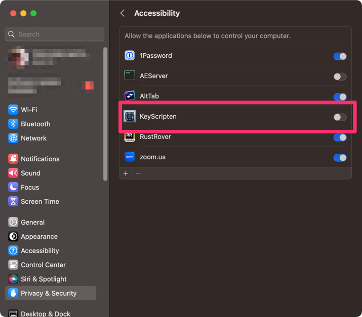

# KeyScripten.app

This app is the programmable keyboard macro system for Mac OSX.
You can write any keyboard handler by JavaScript.

This app contains some of the official plugins:

  * implementation of the [Toshiyuki Masui san's Dynamic Macro](https://gihyo.jp/dev/serial/01/masui-columbus/0006)

(Current implementation doesn't support user's own javascript handler)

## How it works?

There's a `CGEventTapCreate` function on mac osx. This function provides the feature to retrieve the user's input.
This application forwards the event to JavaScript code.

## Accessibility permission

You need to allow the accessibility option here. Because this application captures all keyboard input. 

If there's a problem, you may need to remove the application from the accessibility permission list.

## Hacking

### How do I build this?

    npm install
    npm run tauri build

## Release process

 - Update version field in `src-tauri/tauri.conf.json5`.
 - Create new GitHub release s in draft.

## Configuration

This app loads the configuration file from `~/Library/Application Support/keyscripten/config.json`.
You can change the shortcut key by this file(I will add the shortcut key configuration in the future release).

## LICENSE

    The MIT License (MIT)
    
    Copyright © 2023 Tokuhiro Matsuno, http://64p.org/ <tokuhirom@gmail.com>
    
    Permission is hereby granted, free of charge, to any person obtaining a copy
    of this software and associated documentation files (the “Software”), to deal
    in the Software without restriction, including without limitation the rights
    to use, copy, modify, merge, publish, distribute, sublicense, and/or sell
    copies of the Software, and to permit persons to whom the Software is
    furnished to do so, subject to the following conditions:
    
    The above copyright notice and this permission notice shall be included in
    all copies or substantial portions of the Software.
    
    THE SOFTWARE IS PROVIDED “AS IS”, WITHOUT WARRANTY OF ANY KIND, EXPRESS OR
    IMPLIED, INCLUDING BUT NOT LIMITED TO THE WARRANTIES OF MERCHANTABILITY,
    FITNESS FOR A PARTICULAR PURPOSE AND NONINFRINGEMENT. IN NO EVENT SHALL THE
    AUTHORS OR COPYRIGHT HOLDERS BE LIABLE FOR ANY CLAIM, DAMAGES OR OTHER
    LIABILITY, WHETHER IN AN ACTION OF CONTRACT, TORT OR OTHERWISE, ARISING FROM,
    OUT OF OR IN CONNECTION WITH THE SOFTWARE OR THE USE OR OTHER DEALINGS IN
    THE SOFTWARE.

## THANKS TO

I refer the rdev to implement this application: https://github.com/Narsil/rdev/blob/main/LICENSE

## LIMITATIONS

  - If you want to use symbols as a shortcut key with JIS keyboard, maybe there's an issue on some keys...
    - I don't have a JIS keyboard. patches welcome.

## SEE ALSO

https://qiita.com/hanspond/items/7e23d4853ab22968500c

There's a keyboard input related apps written in rust.

- [Tickeys](https://github.com/yingDev/Tickeys)
  - Instant audio feedback for typing. macOS version. (Rust)
- [modelm](https://github.com/millerjs/modelm)
  - Mechanical keyboard sound simulator in Rust
- [rustdesk](https://github.com/rustdesk/rustdesk)
  - An open-source remote desktop, and alternative to TeamViewer.
- [makepad](https://github.com/makepad/makepad)
  - Makepad is a creative software development platform for Rust that compiles to wasm/webGL, osx/metal, windows/dx11 linux/opengl
- [enigo](https://github.com/enigo-rs/enigo)
  - Cross platform input simulation in Rust
- [mouce](https://github.com/fufesou/mouce)
  - Rust library to control the mouse

### Dynamic macro related links

- [DynamicMacroAHK](https://forestail.com/programing/dynamic-macro-autohotkey/)
- [Dynamic Macro](http://www.pitecan.com/papers/JSSSTDmacro/JSSSTDmacro.html)
